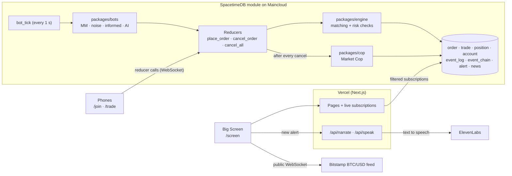

# THE PIT

**A live, play-money stock exchange where people trade from their phones against AI bots, and an AI Market Cop catches manipulation in real time, explains it in plain English, and says it out loud.**

Built in 24 hours at MHacks 2026. Live at **[the-pit-seven.vercel.app](https://the-pit-seven.vercel.app/screen)**: open `/screen` on a big display and scan the QR code with a phone to trade.

> Markets are only fair if someone is watching.

---

## Contents

1. [Why we built it](#why-we-built-it)
2. [Results at a glance](#results-at-a-glance)
3. [What it does](#what-it-does)
4. [How it works](#how-it-works)
5. [Tech stack](#tech-stack)
6. [Repository layout](#repository-layout)
7. [Getting started](#getting-started)
8. [Environment variables](#environment-variables)
9. [Running and operating it](#running-and-operating-it)
10. [Testing](#testing)
11. [Evaluation and benchmarks](#evaluation-and-benchmarks)
12. [What is real and what is simulated](#what-is-real-and-what-is-simulated)
13. [Limitations](#limitations)
14. [Security and privacy](#security-and-privacy)
15. [Troubleshooting](#troubleshooting)
16. [Roadmap](#roadmap)
17. [Team](#team)

---

## Why we built it

**Spoofing** is a market manipulation where a trader places large orders they never intend to fill, to fake supply or demand, trades the other way at the better price, then cancels the fake orders. It is illegal in regulated markets, it hurts ordinary traders, and the surveillance tools that catch it are private systems inside exchanges.

The Pit makes that hidden world tangible. Judges join a live market from their phones, trade against bots, and can **try to cheat**. The Market Cop catches them within milliseconds, shows the evidence, and reads the citation aloud. We then measured how good the Cop really is, published where it fails, and pointed it at a real crypto market.

## Results at a glance

| What we measured | Result |
|---|---|
| Cop on simulated sessions (50 seeds, 4 conditions) | **100% recall, 100% precision**, 0 false alarms on the market maker |
| Cop on **171 held-out real crypto price paths** (BTC, ETH, SOL, LTC) | Spoofer caught in **171/171** sessions, **0 false alarms** on every other bot, including the adaptive AI |
| Evasive spoofers (trade 4 s after layering, or cancel 6 s after trading) | **0/171 caught**: we publish this limit (see [Limitations](#limitations)) |
| Alert latency, live market | Spoof alerted **7 to 10 ms** after the first fake order, in the same database transaction as the cancel |
| Order latency vs. market history | **15.3 ms → 1.3 ms** at 50,000 historical orders, flat up to 100,000 |
| Data a phone downloads on page load | **151,808 rows / ~38 MB → 1,208 rows / ~0.3 MB** on a market with 50,000 orders of history |
| ElevenLabs voice for an alert | Full sentence as audio in **~0.65 s** |
| Automated tests | **127 passing** unit and simulation tests, plus 6 live database acceptance tests |

Every number comes from a script in this repository; the commands are in [Evaluation and benchmarks](#evaluation-and-benchmarks).

## What it does

**For players (phones)**
- **Join in seconds**: scan the QR code, pick a display name, start with 10,000 play dollars. No password, no real money.
- **Trade HACK**, a synthetic index: limit orders, price and quantity steppers, open orders, cancel, live net worth and profit.
- **Beat the Cop**: a 60-second challenge. Make money any way you like, even by cheating, but every Cop alert costs 500 points.
- **Try to cheat**: one button runs a real spoofing sequence (fake sell wall, opposite buy, pull the wall) so anyone can see the Cop react.
- **Citation card**: if the Cop catches you, you get a downloadable, stamped citation with the evidence.

**On the Big Screen (`/screen`)**
- Live **price chart, order book ladder, depth chart, trade tape, leaderboard** (every trader wears a jacket badge; bots wear outlined badges), and a scrolling ticker.
- **Market Cop desk**: each alert arrives as a citation ticket with its evidence, a police-tape band sweeps across the screen, and the Cop **reads the alert aloud with ElevenLabs** (browser voice as a fallback).
- **Record sealed** line: the live head of the tamper-evident event chain.
- **The Cop's eyes on live BTC**: real BTC/USD order flow from Bitstamp's public feed, with the warning signs the Cop looks for (orders cancelled without trading, "flash orders" that appear near the price and vanish within seconds).

**In the market**
- **Bots trade 24/7 inside the database**: an Avellaneda-Stoikov market maker, three noise traders, an informed trader that sees a hidden "true value", and an optional adaptive AI trader.
- **Delayed news**: every 10 seconds a noisy hint of the hidden value is published 5 seconds late.
- **Tamper-evident record**: every event is chained with SHA-256 in the same transaction. Editing or deleting any past event is detected by the auditor.

## How it works



**One order, end to end**
1. A phone calls the `place_order` reducer over a WebSocket.
2. Inside one SpacetimeDB transaction, the module loads only the open orders and the accounts involved, runs the pure matching engine (`packages/engine`: price-time priority, partial fills, risk checks), and writes orders, trades, positions, cash and `event_log` rows. Each event also gets a SHA-256 link in `event_chain`.
3. When a trader cancels, the **Market Cop** (`packages/cop`) runs **in the same transaction**: it reads the last 30 seconds of that trader's events through an index and, if the spoofing rule matches, writes an `alert` with structured evidence.
4. Every screen is subscribed to just the rows it renders, so the alert, the trade and the new prices reach all phones and the Big Screen within milliseconds.
5. The Big Screen sends the new alert to `/api/speak`; the server writes the Cop's sentence from the evidence and returns ElevenLabs audio.

**The Market Cop's spoofing rule** (spec section 5): within a rolling 30-second window, flag an account that
- (a) rests **3 or more orders on one side at 2 or more price levels**, totalling **at least 3× its median order size**;
- (b) **trades the opposite side within 3 seconds** of placing them;
- (c) **cancels at least 80%** of the layered size **within 5 seconds** of that trade.

Alerts score 70 to 100 and carry the order ids, prices, times and quantities that triggered them. The repo also contains quote-stuffing and wash-trading detectors (`packages/cop/src/extra.ts`, tested, not yet wired into alerts) and `explainWindow`, which powers the "how close you were to getting caught" view.

**Design principles**
- **Pure core**: `packages/engine`, `packages/bots` and `packages/cop` have no network access, no `Date.now()` and no `Math.random()`; clocks and random generators are injected, so every simulation is reproducible and every exported function is unit-tested.
- **Integer money**: prices are integer ticks and quantities are integers.
- **One backend**: matching, bots, the Cop and the audit trail all run inside the SpacetimeDB module, so no extra server has to stay awake.

## Tech stack

| Layer | Technology |
|---|---|
| Language | TypeScript everywhere |
| Monorepo | pnpm workspaces (pnpm 12.8.1 via Corepack), Node.js 24 |
| Database and backend | [SpacetimeDB](https://spacetimedb.com) 2.10 (TypeScript module, hosted on Maincloud): tables, reducers, scheduled reducers, subscriptions |
| Web app | Next.js 16 (App Router), React 19, plain CSS, `next/font` (Big Shoulders, Atkinson Hyperlegible Next) |
| Hosting | Vercel |
| Voice | ElevenLabs text-to-speech (server-side), browser `speechSynthesis` fallback |
| Narration | Grounded template sentences; optional Claude (Anthropic API) rewrite when `LLM_API_KEY` is set |
| Real market data | Bitstamp public WebSocket (live BTC/USD order flow); Coinbase public candles (historical price paths for simulation) |
| Testing | Vitest; live acceptance tests against disposable local SpacetimeDB databases; GitHub Actions |

No database, AI or chart libraries were added beyond these: charts are hand-written SVG, SHA-256 is implemented in `packages/cop/src/chain.ts`, and the LLM and ElevenLabs calls use plain `fetch`.

## Repository layout

```
the-pit/
├── apps/
│   ├── web/                    Next.js app (Vercel)
│   │   ├── app/screen/         Big Screen: board, charts, Cop desk, live BTC panel
│   │   ├── app/join/, trade/   Phone pages: join, trade, Beat the Cop, citation card
│   │   ├── app/api/narrate/    Alert evidence -> one grounded sentence
│   │   ├── app/api/speak/      Alert -> ElevenLabs audio (server-side key)
│   │   └── lib/                Live connection, filtered subscriptions, narrator, speech,
│   │                           jacket badges, Bitstamp adapter
│   └── runner/                 Tools: exchange auditor, benchmarks, legacy desktop bot runner
├── packages/
│   ├── engine/                 Pure matching engine and risk checks
│   ├── bots/                   Pure bot strategies, simulator (runSession), live tick planner,
│   │   └── data/               188-572 real price paths (Coinbase candles, rescaled)
│   ├── cop/                    Market Cop: spoofing rule, extra detectors, market watch,
│   │   └── fixtures/           SHA-256 hash chain, explainers; recorded event streams
│   └── bindings/               Generated SpacetimeDB client bindings
├── spacetimedb/spacetimedb/    SpacetimeDB module: tables, reducers, bot tick, in-transaction Cop
├── scripts/                    Price-path fetcher, Windows runner and integration scripts
└── docs/                       Spec, decisions, evaluations, benchmarks, limitations, runbooks
```

Key documents: [`docs/spec.md`](docs/spec.md) (contract between modules), [`docs/DECISIONS.md`](docs/DECISIONS.md), [`docs/EVALUATION.md`](docs/EVALUATION.md), [`docs/REAL_DATA_EVAL.md`](docs/REAL_DATA_EVAL.md), [`docs/ADAPTIVE_EVAL.md`](docs/ADAPTIVE_EVAL.md), [`docs/LOAD_TEST.md`](docs/LOAD_TEST.md), [`docs/LIMITATIONS.md`](docs/LIMITATIONS.md), [`docs/RUNNER.md`](docs/RUNNER.md), [`docs/CLI.md`](docs/CLI.md).

## Getting started

### Prerequisites

| Tool | Version | Notes |
|---|---|---|
| Node.js | 24 | CI uses Node 24 |
| pnpm | 12.8.1 | Enable with `corepack enable`; the version is pinned in `package.json` |
| SpacetimeDB CLI | 2.10.2 | Install from [spacetimedb.com/install](https://spacetimedb.com/install); provides `spacetime start`, `publish`, `call`, `sql`, `generate` |
| Git | any recent | |

Optional: an ElevenLabs API key with the **Text to Speech** permission (voice), an Anthropic API key (LLM narration). Without them, the app uses the browser voice and template narration.

### Install, test and build

```sh
git clone https://github.com/MHacks-2026/the-pit.git
cd the-pit
corepack enable
pnpm install
pnpm test      # unit and simulation tests (about 30 s)
pnpm build     # type-checks every package and builds the web app
```

### Run the whole stack locally

1. **Start a local SpacetimeDB server** (in its own terminal):
   ```sh
   spacetime start
   ```
2. **Publish the module** to a local database:
   ```sh
   spacetime publish the-pit-local --module-path spacetimedb/spacetimedb --server local --yes
   ```
   The identity that publishes the database becomes its admin.
3. **Start the bots inside the database** (`true` also enables the adaptive AI trader):
   ```sh
   spacetime call the-pit-local admin_bots_start true --server local
   ```
4. **Configure and start the web app**: create `apps/web/.env.local` (git ignores it):
   ```sh
   NEXT_PUBLIC_SPACETIME_URI=ws://127.0.0.1:3000
   NEXT_PUBLIC_SPACETIME_DB=the-pit-local
   # optional
   ELEVENLABS_API_KEY=...
   ```
   ```sh
   pnpm --filter web dev
   ```
5. Open **http://localhost:3000/screen** (Next.js picks another port if 3000 is taken by SpacetimeDB; use the port it prints), then `/join` in another window or on a phone on the same network.

To trigger the Cop by hand, join from `/trade`, start **Beat the Cop** and press **Try to cheat**.

### Regenerate client bindings

After changing tables or reducers in the module:
```sh
spacetime generate --lang typescript --out-dir packages/bindings/src --module-path spacetimedb/spacetimedb --yes
```

## Environment variables

Names are listed in [`.env.example`](.env.example). Real values live in Vercel and local `.env.local` files, never in git.

| Variable | Where | Purpose |
|---|---|---|
| `NEXT_PUBLIC_SPACETIME_URI` | Web | SpacetimeDB WebSocket address. Production must use `wss://` (e.g. `wss://maincloud.spacetimedb.com`) |
| `NEXT_PUBLIC_SPACETIME_DB` | Web | Database name (production: `the-pit-mhacks-2026`) |
| `ELEVENLABS_API_KEY` | Web server only | Cop voice. Needs the Text to Speech permission. Never prefix with `NEXT_PUBLIC_` |
| `ELEVENLABS_VOICE_ID` | Web server only | Optional; default is ElevenLabs' premade "Daniel" voice |
| `ELEVENLABS_MODEL_ID` | Web server only | Optional; default `eleven_flash_v2_5` (low latency) |
| `LLM_API_KEY` | Web server only | Optional Anthropic key; narration is rewritten by Claude but only accepted if every number in it appears in the evidence |
| `NARRATOR_ENABLED` | Web server only | Kill switch: `false` turns off the LLM and ElevenLabs calls (template text and browser voice remain) |
| `NEXT_PUBLIC_MARKET_WATCH` | Web | `false` hides the live BTC panel |
| `ADMIN_TOKEN`, `PIT_*` | Legacy runner and tests | Only for `apps/runner` (see [`docs/RUNNER.md`](docs/RUNNER.md)) |

## Running and operating it

All admin reducers must be called by the identity that published the database. Replace `--server local` with `--server maincloud` and the database name with `the-pit-mhacks-2026` for production.

| Task | Command |
|---|---|
| Start in-database bots | `spacetime call <db> admin_bots_start true` |
| Stop in-database bots (cancels their orders) | `spacetime call <db> admin_bots_stop` |
| **Reset the market before a demo** (deletes orders, trades, positions, event log, news, alerts and all player accounts; bots stay) | `spacetime call <db> admin_reset_market 1` |
| Check the market is healthy and the record is untampered | from `apps/runner`: `NEXT_PUBLIC_SPACETIME_URI=<uri> NEXT_PUBLIC_SPACETIME_DB=<db> node --import tsx src/audit-cli.ts` |
| Inspect data | `spacetime sql <db> "SELECT COUNT(*) FROM trade"` |
| Upgrade the live module in place | `spacetime publish <db> --module-path spacetimedb/spacetimedb --server maincloud` (**never** with `--delete-data`) |

**Deployment**
- **Web**: Vercel builds `apps/web` from `main`. Set the environment variables above in the Vercel project, then redeploy.
- **Database**: the module runs on SpacetimeDB Maincloud. Upgrades are published in place; new tables and indexes migrate automatically (tested on databases with 50,000+ orders).
- **Bots**: run inside the module via `bot_tick`. The legacy desktop runner in `apps/runner` is a fallback only; **never run it and the in-database bots at the same time**.

**Before judging**: reset the market, open `/screen` full-screen, click **Turn on Cop voice** once (browsers block sound until someone clicks), and keep a phone hotspot as a backup network.

## Testing

| Command | What it covers |
|---|---|
| `pnpm test` | All unit and simulation tests: engine, bots, Cop, hash chain, narrator, voice, badges, the 50-seed evaluation |
| `pnpm build` | Type-checks every package and builds the web app |
| `PIT_TRAIN=1 pnpm exec vitest run packages/bots/src/adaptiveTraining.test.ts` | Retrains the adaptive AI and regenerates `docs/ADAPTIVE_EVAL.md` (about 3 minutes) |
| `PIT_EVAL_REAL=1 pnpm exec vitest run packages/bots/src/realDataEval.test.ts` | Real-data tournament and Cop check, regenerates `docs/REAL_DATA_EVAL.md` |
| Live acceptance tests | `spacetimedb/test/*.test.ts` and `apps/runner/test/*.test.ts` run against a local database on port 3000 (set `PIT_TEST_DATABASE`, `ADMIN_TOKEN`). Run the files one at a time: they trade at the same prices |
| Windows end-to-end | `powershell -File scripts/test-local-integration.ps1` (add `-Load` for the load test); also runs in GitHub Actions |

## Evaluation and benchmarks

**Market Cop, simulated sessions** ([`docs/EVALUATION.md`](docs/EVALUATION.md)): 50 seeds × 60 s per condition, real matching engine and bots.

| Condition | Spoofer caught | Alerts on other accounts |
|---|---|---|
| Market maker + noise + informed | n/a | 0 |
| Fast-requoting market maker (250 ms) | n/a | 0 |
| With spoofer | 50/50 | 0 |
| With spoofer + fast market maker | 50/50 | 0 |

**Market Cop, real price paths** ([`docs/REAL_DATA_EVAL.md`](docs/REAL_DATA_EVAL.md)): 171 held-out paths built from 30 days of Coinbase 1-minute candles.

| Condition | Spoofer caught | False alarms |
|---|---|---|
| No spoofer | n/a | 0 |
| Default spoofer | **171/171** | **0** |
| Evasive: trades 4 s after layering | 0/171 | 0 |
| Evasive: cancels 6 s after trading | 0/171 | 0 |

**Which bot does best on real data** (no spoofer, mean play dollars per session): market maker **+102**, noise traders +8 to +16, adaptive AI −52, informed −88. With the spoofer present it averaged +67 and the adaptive AI dropped to −124: spoofing pays and hurts the algorithmic trader, which is why the Cop matters.

**Adaptive AI trader** ([`docs/ADAPTIVE_EVAL.md`](docs/ADAPTIVE_EVAL.md)): a discounted Thompson-sampling bandit over five strategies, using only public information. Trained on 70% of the real paths plus synthetic sessions, tuned on a validation slice, reported on held-out paths: −30 per session, against −202 untrained and 0 for not trading. Honest headline: it learned to stop losing, not to win. All earlier versions' results are listed in that report.

**Performance** ([`docs/LOAD_TEST.md`](docs/LOAD_TEST.md)), local SpacetimeDB 2.10.2:

| Benchmark | Before | After |
|---|---|---|
| `place_order` p50 at 50,000 historical orders | 15.3 ms | **1.3 ms** (flat to 100,000) |
| Phone page load on a 50,000-order market | 151,808 rows, ~38 MB, 641 ms | **1,208 rows, ~0.3 MB, 8.7 ms** |
| `cancel_all` with the in-transaction Cop, live market | n/a | 1.8 ms p50 |
| Market reset of 30,000 orders, 15,000 trades, 45,000 events | n/a | 114 ms |

Reproduce: `apps/runner/src/history-bench.ts` and `apps/runner/src/subscription-bench.ts` (instructions at the top of each file and in `docs/LOAD_TEST.md`).

## What is real and what is simulated

| Real | Simulated or mocked |
|---|---|
| The exchange: matching engine, risk checks, positions, cash, the order book | All money (play dollars only; nothing can be withdrawn) |
| Every human trade and every alert during the demo | The bots and the spoofer used in evaluations |
| The Market Cop's detection, evidence and alerts | The hidden "true value" (a random walk, or a rescaled real price path in simulations) |
| ElevenLabs voice (when a key is set) | Narration text: a grounded template (an LLM rewrite is supported but off without a key) |
| Bitstamp BTC/USD order flow in the live panel | The citation card's "agency" (fictional, stated on the card) |
| SHA-256 hash chain over the event log | |
| Coinbase price data shaping the simulated paths (30 days, rescaled to HACK ticks) | |

## Limitations

Summarised from [`docs/LIMITATIONS.md`](docs/LIMITATIONS.md), which also has a one-line answer for judges:

- **The spoofer was built against the Cop's rule.** The 100% results show the detector and our spoofer agree; they do not show the Cop catches manipulators it was not designed around. Waiting 4 seconds before trading, or 6 seconds before cancelling, evades it every time.
- **No false alarms means none on our bots.** Real market makers and human traders behave differently and were not tested.
- **Public market data has no account ids,** so on the live BTC panel the rule cannot run; it shows warning signs, not suspects, and most flash orders are ordinary market makers re-quoting.
- **The record is tamper-evident, not tamper-proof.** The database owner could rewrite every hash consistently; the live head shown on the Big Screen is the protection.
- **Cancel cost grows with recent activity.** The in-transaction Cop reads the last 30 seconds of events: 1.8 ms on the live market, about 49 ms under a flood of 10,000 orders.
- **Everything is play money and simulated traders** except the people in the room.

## Security and privacy

- **Play money only.** No real money, brokerage data or payment details, ever (decision D7).
- **Secrets stay server-side.** The ElevenLabs and LLM keys are read only in Next.js API routes; `.env` files are git-ignored. `/api/speak` only voices the narrator's own sentence for an alert, never arbitrary text, and is rate-limited.
- **Admin actions** (bots, reset, settlement) check the caller against the database's admin identity.
- **Players** choose a display name only. Each browser keeps a SpacetimeDB token in `localStorage` to stay the same trader across pages.
- **Public tables**: market data, alerts and the hash chain are public so anyone can verify them.

## Troubleshooting

| Symptom | Fix |
|---|---|
| `/trade` says "You haven't joined yet" right after joining | Fixed in the redesign: every page now shares one token-carrying connection. Make sure you are on the latest deploy; clearing site data starts a new player |
| `/screen` shows "The live market is not configured" | Set `NEXT_PUBLIC_SPACETIME_URI` (`wss://` in production) and `NEXT_PUBLIC_SPACETIME_DB`, then redeploy |
| The Cop stays silent | Click **Turn on Cop voice** once. The label shows which engine is speaking; "Browser voice" means the ElevenLabs key is missing or lacks the Text to Speech permission |
| Live BTC panel says the feed is unavailable | The network blocks `wss://ws.bitstamp.net`; use another network or set `NEXT_PUBLIC_MARKET_WATCH=false` |
| Bots doubled / prices jumping wildly | The legacy runner and the in-database bots are both running. Stop one (`admin_bots_stop` or the runner task) |
| A live acceptance test fails with odd trades | The live test files were run in parallel against one database; run them one at a time |
| `spacetime start` fails | Port 3000 is in use; stop the other server or pass `--listen-addr 127.0.0.1:<port>` |

## Roadmap

- **Close the evasion gap**: a v2 rule with wider, scored windows, proven with the existing harness before shipping.
- **A learned Cop**: train a gradient-boosted model on randomised simulated spoofers over real Bitstamp order flow. Tree models compile to plain code, so it can still run inside the database transaction.
- **Faster cancels under load**: an `(owner, ts)` index so the Cop reads only the canceller's events.
- **Publish the hash-chain head** somewhere independent on a schedule.
- **Event markets and settlement** (binary contracts priced 1 to 99), and LLM narration when a key is available.

## Team

Built at MHacks 2026 by **Rajvansh Ratti**, **Prasiddha Poudyal**, **Shafir Khajo** and **Charvik Reddy Mukku**.

Thanks to the MHacks organisers, SpacetimeDB (Clockwork Labs) and ElevenLabs.
